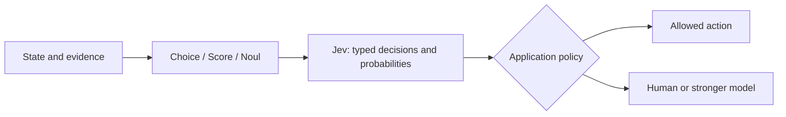
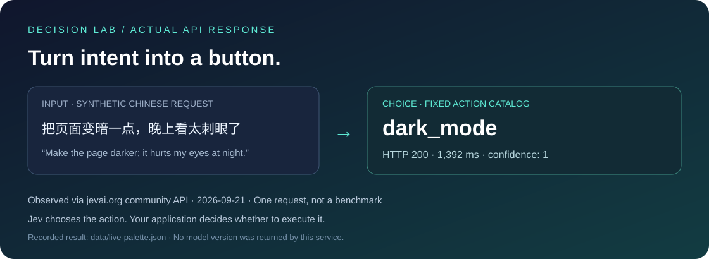

<div align="center">


# ⚡ Everything about Jev

**Understand the model. Run real examples. Read the evidence.**

[](https://github.com/qingshungLI/everything-about-jev/actions/workflows/checks.yml)
[](LICENSE)
[](README.en.md)
[](ATTRIBUTION.md)

**[简体中文](README.md) · [English](README.en.md)**

</div>

> **Understand it in three minutes. Make a real call in five.** Jev is TypeSafe AI's typed decision model: supply state and bounded questions, receive choices, scores or probabilities, and let your application determine the next step.

<p align="center"><a href="#-what-jev-does">🧠 Understand</a> · <a href="#-quickstart-real-api-calls">🚀 Run</a> · <a href="#-decision-lab">🎮 Explore</a> · <a href="#-what-the-community-thinks">💬 Discuss</a> · <a href="catalog/demos.md">🗺️ Discover</a></p>

## 🧠 What Jev does

For a message saying “I was charged twice,” Jev can decide the owning team, whether review is needed, and urgency. You define the candidate outcomes and rubric first. Your code handles the result.



| Primitive | Question | Response | Watch out |
| --- | --- | --- | --- |
| Choice | Billing, technical or other? | choice, confidence, probabilities | Confidence is distinct from the winning probability |
| Noul | Does this policy require review? | Probability of yes | Not a Boolean decision |
| Score | How severe on this rubric? | Expected score and distribution | Scores may be fractional |

Use it for classification, routing, relevance and bounded actions. Use other tools for writing, exact arithmetic, fresh retrieval and reliable planning. Schema conformance does not prove semantic correctness. [Guide](docs/en/system-overview.md) · [Official schema](https://github.com/typesafe-ai/typesafe-sdk-python/blob/main/src/typesafe_sdk/_schemas/models.py).

## 🚀 Quickstart: real API calls

This path uses the user-specified **jevai.org community REST API**, with its own key and envelope. It is separate from TypeSafe's official SDK. [Provider distinction and troubleshooting](docs/en/getting-started.md) ? [Provider/credential table](docs/providers.md).

```bash
git clone https://github.com/qingshungLI/everything-about-jev.git
cd everything-about-jev
python -m pip install -r requirements.txt
```

Create `.env` in the repository root:

```dotenv
JEVAI_API_KEY=your-community-service-key
```

```bash
python demos/python/quickstart.py
```

Python 3.10+. The default command-palette case maps a Chinese request for a darker page to `dark_mode`. Keys remain outside Git. The legacy lowercase `typesafe_api_key` is accepted for this user's setup; uppercase official `TYPESAFE_API_KEY` is never forwarded to the community host.

<details>
<summary>TypeScript, official SDK and offline checks</summary>

```bash
npm ci
npm run check
npm run demo:community
python -m unittest discover -s tests -v
```

Node.js 20+. Official SDK examples are separate: [Python](demos/python/jev_demo.py) and [TypeScript](demos/typescript/jev-demo.ts). Community API testing does not establish that the official direct endpoint was live-tested.

</details>

## 🎮 Decision Lab

<a href="data/live-palette.json"></a>

| Experiment | Supplied evidence | Decision | Argument |
| --- | --- | --- | --- |
| 🌙 Command palette | Request for a darker page and available actions | Select an action | `--case palette` |
| 🧾 Ticket radar | Duplicate charge and review policy | Queue, review and urgency | `--case ticket` |
| 🔎 Claim check | Universal speed claim and one narrow demo | Evidence support | `--case research` |
| 🧭 Model router | Task and two model candidates | Best-fitting candidate | `--case model-route` |
| 🛑 Tool guard | Destructive action and a restrictive policy | Allow or block suggestion | `--case tool-guard` |
| ✅ Completion check | Code written but API never run | Is the work complete? | `--case completion` |

```bash
python demos/python/quickstart.py --case research
```

A revealing actual result: the universal “100 times faster” claim received `reject`, with probability **0.55**, confidence **0.33**, and **0.45** assigned to `verify_more`. A label is not certainty, and confidence is not the same field as the selected probability. [Recorded request and response](data/live-research.json).

Inputs are synthetic; saved responses are actual calls. Consult the [validation ledger](docs/live-validation.md) for successes and rate limits. One latency sample is not an SLA or model benchmark. Preset `guidance` may be server-template text, not prose generated by Jev.

## 💬 What the community thinks

**The main finding:** excitement centers on cheap, fast semantic micro-decisions. Disagreement centers on turning them into reliable planning, judging and context-management systems. Enthusiasm and skepticism can coexist in one author's posts.

| Topic | Enthusiasm | Open question |
| --- | --- | --- |
| Product value | Cheap decisions inside software loops | Does the whole workflow improve? |
| Compaction | Score history, retain exact text | Was discarded information needed later? What about cache cost? |
| Real-time actions | Responsive browser, voice and UI loops | Fast local choices are not global planning |
| Probabilities | Explicit thresholds and escalation | Calibration on your own data is still needed |
| Open implementations | Local deployments and experiments | Compatible interfaces do not prove equivalent quality |

[Tùng Đinh on speed/cost](https://x.com/tdinh_me/status/2100803719575343138) · [Tamara's compaction proposal](https://x.com/tamarajtran/status/2100694549362553153) · [Theo's critique](https://x.com/theo/status/2100762304862384257) · [Theo's qualified endorsement](https://x.com/theo/status/2101857305570721847) · [Karminski's reported maze failure](https://x.com/karminski3/status/2101941770003361893).

➡️ **[Read the community report](docs/en/community-report.md)** for arguments, counterexamples, engineering implications and sampling limits.
**Recording kit:** [Demo studio](demos/README.md) ? [Offline browser demo](demos/web/index.html) ? [Agent integration](docs/agent.md)

## 🗺️ Your reading path

| Time | Read | Outcome |
| --- | --- | --- |
| 3 minutes | [System overview](docs/en/system-overview.md) | State, questions, answers and limits |
| 5 minutes | [Getting started](docs/en/getting-started.md) | A real request |
| 10 minutes | [Community report](docs/en/community-report.md) | Both enthusiasm and criticism |
| 15 minutes | [Engineering patterns](docs/en/patterns.md) | Thresholds, evaluation and execution boundaries |
| Explore | [Demo map](catalog/demos.md) · [Project guide](catalog/projects.md) | Useful starting projects |

## 🔬 Transparent evidence

**5** upstream repositories · **735** unverified discovery links · **8** X queries · **19** pages · **337** unique posts.

Discovery counts are not verified-project counts. The purposive sample is not a support poll; we have not manually stance-labeled every post. [Method](docs/en/community-report.md#method-and-limits) · [Page audit](data/x-search.json) · [Upstream commits](data/upstreams.json) · [Attribution](ATTRIBUTION.md).

Contribute failures, reproducible experiments and corrections via [CONTRIBUTING.md](CONTRIBUTING.md). Independent community repository, unaffiliated with TypeSafe AI or jevai.org.
