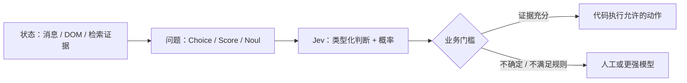

<div align="center">


# ⚡ Everything about Jev

**Understand the model. Run real examples. Read the evidence.**

[](https://github.com/qingshungLI/everything-about-jev/actions/workflows/checks.yml)
[](LICENSE)
[](README.en.md)
[](ATTRIBUTION.md)

**[简体中文](README.md) · [English](README.en.md)**

</div>

> **三分钟理解，五分钟上手。** Jev 是 TypeSafe AI 的类型化决策模型：给它业务状态和限定答案的问题，它返回选项、评分或“是”的概率，由你的程序决定下一步。

<p align="center"><a href="#-先理解jev-到底做什么">🧠 原理</a> · <a href="#-快速开始已真实调用">🚀 上手</a> · <a href="#-decision-lab把判断做成产品">🎮 实验室</a> · <a href="#-社区究竟怎么看">💬 社区</a> · <a href="catalog/demos.md">🗺️ 项目</a></p>

## 🧠 先理解：Jev 到底做什么？

假设你收到“我的订阅扣了两次钱”。普通生成模型可以写一封回复；Jev 可以同时判断 **交给哪个团队、是否需要人工、紧急程度是多少**。你先给出选项和判断标准，再得到程序可直接读取的结果。



| 原语 | 问什么 | 返回什么 | 易混淆的点 |
| --- | --- | --- | --- |
| **Choice** | 账单、技术还是其他？ | `choice`、`confidence`、`probabilities` | confidence 与获选概率是不同字段 |
| **Noul** | 按这条政策，需要人工吗？ | `noul`，是的概率 | 不是已经决定好的布尔值 |
| **Score** | 按这份量表，严重程度怎样？ | `score`、分布等 | 期望分数可能为小数 |

**适合**：分类、路由、相关性、筛选、有限动作选择。**仍需其他工具**：文章和代码生成、精确计算、实时检索、可靠的多步规划。固定 schema 保证输出形状，不保证判断正确。[完整说明](docs/system-overview.md) · [官方 schema](https://github.com/typesafe-ai/typesafe-sdk-python/blob/main/src/typesafe_sdk/_schemas/models.py)。

## 🚀 快速开始：已真实调用

以下路径使用用户指定的 **jevai.org 社区 REST API**，与 TypeSafe 官方直连密钥分开。我们确实发送了请求并保存回答，不只检查语法。[接入区别与排错](docs/getting-started.md)。

```bash
git clone https://github.com/qingshungLI/everything-about-jev.git
cd everything-about-jev
python -m pip install -r requirements.txt
```

在根目录创建 `.env`（可参考 [.env.example](.env.example)）：

```dotenv
JEVAI_API_KEY=你的社区服务密钥
```

```bash
python demos/python/quickstart.py
```

默认运行自然语言命令面板：返回 `dark_mode`，而不是生成一段解释。Python 3.10+；密钥不进入 Git。用户已有的小写 `typesafe_api_key` 也兼容，但**官方大写 `TYPESAFE_API_KEY` 不会被发送给社区服务**。

<details>
<summary>TypeScript、官方 SDK 与验证命令</summary>

```bash
npm ci
npm run check
npm run demo:community
python -m unittest discover -s tests -v
```

TypeScript 需要 Node.js 20+。官方 SDK 另见 [Python](demos/python/jev_demo.py) / [TypeScript](demos/typescript/jev-demo.ts)，它们使用官方 `TYPESAFE_API_KEY`。本轮实测覆盖社区端点，不把它冒充官方直连实测。

</details>

## 🎮 Decision Lab：把判断做成产品

<a href="data/live-palette.json"></a>

| 玩法 | 你给的状态 | Jev 做的判断 | 运行 |
| --- | --- | --- | --- |
| 🌙 自然语言命令面板 | “晚上看太刺眼了” + 可用动作 | `dark_mode` | `--case palette` |
| 🧾 三合一工单雷达 | 中文重复扣款 + 处理政策 | 队列、人工需求、紧急度 | `--case ticket` |
| 🔎 宣传证据检查 | “所有任务快 100 倍” + 窄实验 | 是否支持这个结论 | `--case research` |
| 🧭 模型调度 | 任务 + 两个模型候选 | 选择更合适的候选 | `--case model-route` |
| 🛑 工具调用检查 | 删整个目录来清日志 | 判断是否应阻止 | `--case tool-guard` |
| ✅ 完成声明检查 | 写了代码但没调用 API | 判断交付是否完成 | `--case completion` |

```bash
python demos/python/quickstart.py --case research
```

**一个更有意思的真实结果：** 对“所有任务都快 100 倍”的宣传，服务返回 `reject`，但其概率为 **0.55**、confidence 为 **0.33**，另有 **0.45** 给 `verify_more`。这正好说明字段不同、判断有不确定性，不能看见一个标签就当最终事实。[原始输入与结果](data/live-research.json)。

六个案例均为合成业务数据，模型结果按实际返回记录。**以 [实测记录](docs/live-validation.md) 区分成功、限流和未完成项**；一次耗时不是 SLA，返回概率不是准确率。预设接口的 `guidance` 可能来自服务模板，不代表 Jev 生成了解释。

## 💬 社区究竟怎么看？

**初步结论：社区看好低成本、快速的语义微决策；争议集中在把它扩展成规划器、复杂评审器和上下文管理器时是否可靠。** 同一个人可以认可 Jev，同时反对某个用法。

| 讨论轴 | 支持 / 期待 | 质疑 / 待验证 |
| --- | --- | --- |
| 产品价值 | 快、便宜、易嵌入软件循环 | 分类不是新能力，要证明端到端收益 |
| 上下文压缩 | 评分后保留原文，减少等待 | 丢掉的历史是否仍重要？缓存成本呢？ |
| 实时动作 | 浏览器、语音、UI 更顺畅 | 单步快不意味着多步规划可靠 |
| 概率输出 | 可以做阈值与人工回退 | 仍需业务标注集和校准 |
| 开源实现 | 本地部署与接口实验活跃 | 接口兼容不等于训练和效果相同 |

代表性原帖：[Tùng Đinh：价值在快与便宜](https://x.com/tdinh_me/status/2100803719575343138) · [Tamara：即时压缩](https://x.com/tamarajtran/status/2100694549362553153) · [Theo：反对这个压缩方案](https://x.com/theo/status/2100762304862384257) · [Theo：认可 Jev，担心误用](https://x.com/theo/status/2101857305570721847) · [Karminski：迷宫失败案例](https://x.com/karminski3/status/2101941770003361893)。

➡️ **[阅读完整社区研究](docs/community-report.md)**：观点、反例、工程推论与采样偏差，避免把“帖子多”当成“观点已证明”。

## 🗺️ 从理解到实践的阅读路线

| 时间 | 阅读 | 带走什么 |
| --- | --- | --- |
| 3 分钟 | [系统说明](docs/system-overview.md) | 状态、问题、答案与边界 |
| 5 分钟 | [快速开始](docs/getting-started.md) | 跑通一次真实请求 |
| 10 分钟 | [社区报告](docs/community-report.md) | 支持与质疑各自的理由 |
| 15 分钟 | [工程模式](docs/patterns.md) | 门槛、回退、评估和副作用 |
| 按需 | [14 类 Demo 地图](catalog/demos.md) · [项目导航](catalog/projects.md) | 找到适合自己场景的项目 |

## 🔬 证据透明

**5** 个上游仓库 · **735** 个待筛选仓库链接 · **8** 组 X 查询 · **19** 页 · **337** 条去重帖子。

候选数量不等于已验证项目数；帖子样本不是支持率调查。我们做定性选读，没有声称给所有帖子逐条标注立场。[方法与局限](docs/community-report.md#方法与局限) · [分页审计](data/x-search.json) · [上游 commit](data/upstreams.json) · [致谢](ATTRIBUTION.md)。

欢迎提交失败案例、可复现实验和纠错。[贡献指南](CONTRIBUTING.md)。独立社区仓库，不隶属于 TypeSafe AI 或 jevai.org。
