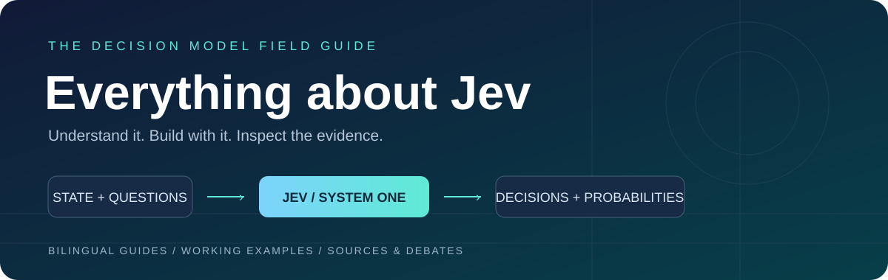

<div align="center">



# Everything about Jev

[](https://github.com/qingshungLI/everything-about-jev/actions/workflows/checks.yml)
[](LICENSE)

[简体中文](README.md) · [English](README.en.md)

</div>

这里整理了 Jev 的使用方法、示例代码、社区项目和讨论。如果你刚听说这个模型，可以先读下面的介绍，再选一个 demo 跑起来。

[快速开始](#快速开始) · [示例](#示例) · [社区讨论](#社区讨论) · [项目目录](catalog/projects.md)

## Jev 是什么

Jev 是 TypeSafe AI 的决策模型。你给它一段文本或业务状态，再定义问题和可选答案，它会返回选择、评分和概率。

比如收到一条“我的订阅扣了两次钱”的消息，你可以让 Jev 判断该交给哪个团队、是否需要人工处理，以及紧急程度。它返回的字段可以直接用于程序里的条件分支。

| 类型 | 用法 | 返回值 |
| --- | --- | --- |
| Choice | 从“账单、技术、其他”中选择 | 选项、confidence、各选项概率 |
| Noul | 判断是否需要人工处理 | “是”的概率 |
| Score | 按给定量表评估紧急程度 | 评分和概率分布，评分可能为小数 |

Jev 适合分类、路由、筛选和有限动作选择。需要写回复时，可以接生成模型；需要查最新信息时，由应用先检索，再把结果传给 Jev。`confidence` 和获选项概率是不同字段，接入时要注意区分。

[系统说明](docs/system-overview.md)介绍了这三类问题、模型边界，以及如何在应用里处理不确定的结果。

## 快速开始

需要 Python 3.10+。下面使用 [jevai.org 社区 API](https://www.jevai.org/docs)；使用 TypeSafe 官方密钥的读者请看[官方 SDK 示例](docs/official-sdk.md)。

```bash
git clone https://github.com/qingshungLI/everything-about-jev.git
cd everything-about-jev
python -m pip install -r requirements.txt
```

在根目录创建 `.env`：

```dotenv
JEVAI_API_KEY=你的社区服务密钥
```

运行：

```bash
python demos/python/quickstart.py
```

默认示例把“把页面变暗一点，晚上看太刺眼了”匹配到 `dark_mode`。它只返回动作名称，不操作浏览器。密钥文件已加入 `.gitignore`。

也可以用 TypeScript（Node.js 20+）：

```bash
npm ci
npm run demo:community
```

遇到限流或密钥问题，参见[接入说明](docs/getting-started.md)。社区 API 和官方 API 使用各自的密钥，具体区别见[供应方对照](docs/providers.md)。

## 示例

| 示例 | 内容 | Python 参数 |
| --- | --- | --- |
| 命令面板 | 根据一句话选择深色模式、导出或帮助 | `--case palette` |
| 工单分类 | 同时判断队列、人工需求和紧急度 | `--case ticket` |
| 资料核对 | 判断提供的资料是否支持一个说法 | `--case research` |
| 模型路由 | 从给定候选中选择适合任务的模型 | `--case model-route` |
| 工具检查 | 检查工具调用是否符合操作规则 | `--case tool-guard` |
| 完成检查 | 根据已完成工作和缺失项判断任务状态 | `--case completion` |

例如：

```bash
python demos/python/quickstart.py --case model-route
```

更多语言和演示入口：

- [Python](demos/python/quickstart.py)、[TypeScript](demos/typescript/community-demo.ts)、[Node.js](demos/node/tool-guard.mjs)、[Bash / curl](demos/curl/tool-guard.sh)。
- [浏览器演示](demos/web/index.html)：离线模拟，适合讲解交互流程。
- [录屏说明](demos/README.md)：启动方式和演示顺序。
- [Agent 与 MCP 接入](docs/agent.md)：在 Agent 中使用这些判断。

示例使用合成数据。API 调用结果和限流情况放在[运行记录](docs/live-validation.md)中。

## 社区讨论

讨论里最常被提到的是速度、成本，以及把分类判断放进现有程序的便利。分歧更多出现在具体用法上：用 Jev 选一个按钮很直观，但用它删减长对话、评价复杂推理或规划多步任务，还需要看整个任务的表现。

几个值得一起读的观点：

- [Tùng Đinh](https://x.com/tdinh_me/status/2100803719575343138)认为通用分类本身并不新，快和便宜才是值得关注的地方。
- [Tamara](https://x.com/tamarajtran/status/2100694549362553153)尝试给工具历史打分，删除不再相关的内容；[Theo](https://x.com/theo/status/2100762304862384257)担心这种压缩会丢掉任务状态，并增加缓存开销。
- [Karminski](https://x.com/karminski3/status/2101941770003361893)报告了迷宫中反复绕圈的案例，提醒使用者区分单步判断与多步规划。

[社区总结](docs/community-report.md)展开了这些讨论，也包括概率校准、本地替代模型和实际应用。材料来自 337 条公开帖子的采集与选读，不代表整个社区的意见比例。

## 更多资料

- [工程模式](docs/patterns.md)：阈值、人工回退、日志与评估。
- [Demo 地图](catalog/demos.md)：浏览器、语音、SQL、游戏等项目。
- [项目目录](catalog/projects.md)与[发现索引](catalog/discovery.md)：后者包含从五个上游列表整理的候选链接，尚未逐项筛选。
- [来源](docs/sources.md)与[致谢](ATTRIBUTION.md)。

欢迎补充项目、分享使用经验或纠正文档，见[贡献指南](CONTRIBUTING.md)。本仓库由社区维护，与 TypeSafe AI 和 jevai.org 无隶属关系。
